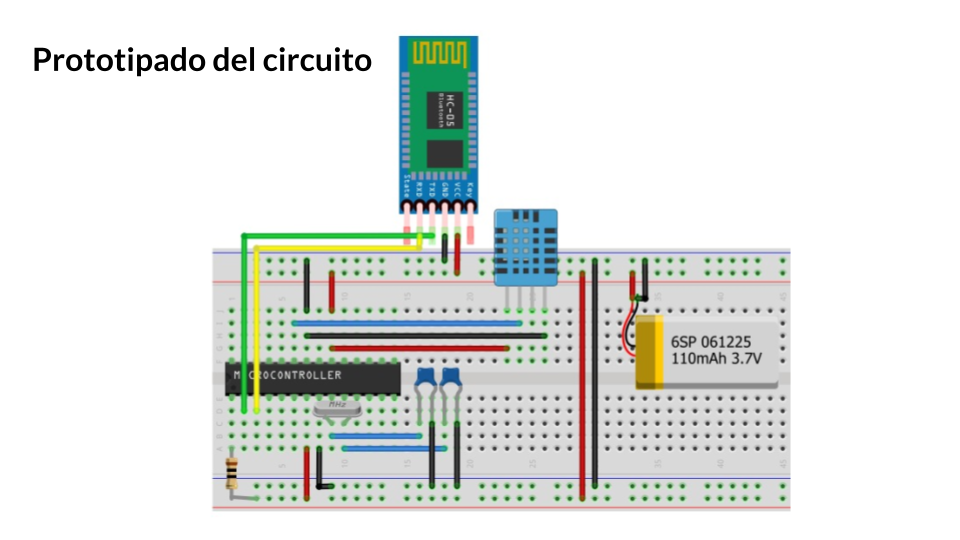

  

 

  
 
 
 
 
 
  
  
 
 
 
 
  

## Codigo/Informacion del Dispositivo 

- Sensor Bluetooth HC-05
- Sensor de humedad DHT11
- Sensor Gas Metano MQ-4
- Arduino Uno
- Protoboard
- Cables de Conexion 

</a>
